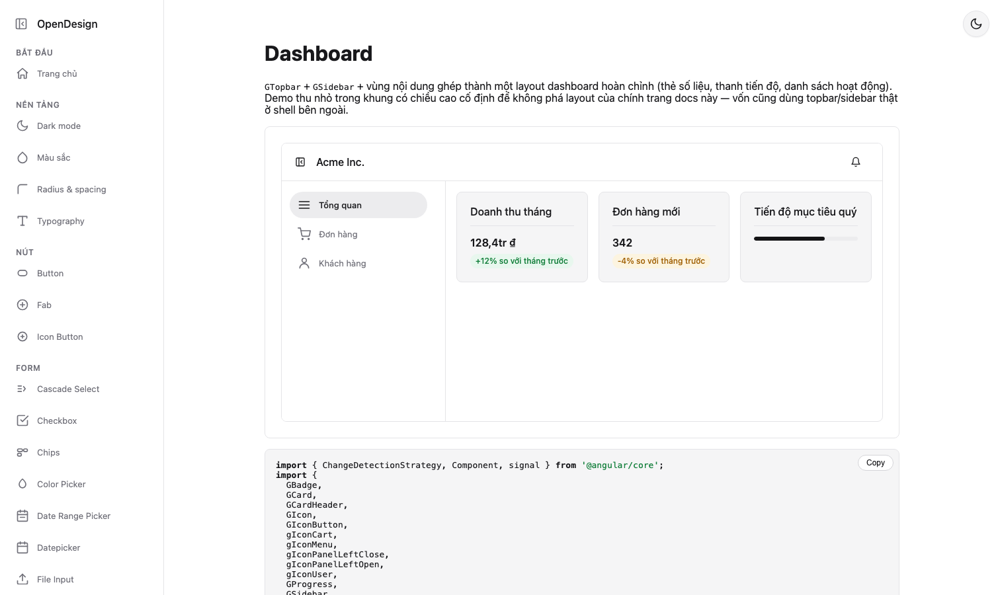
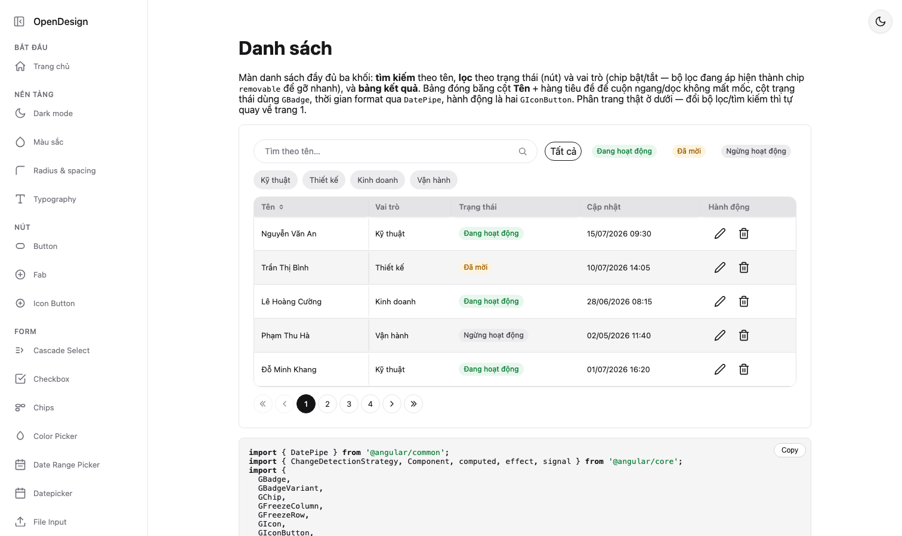
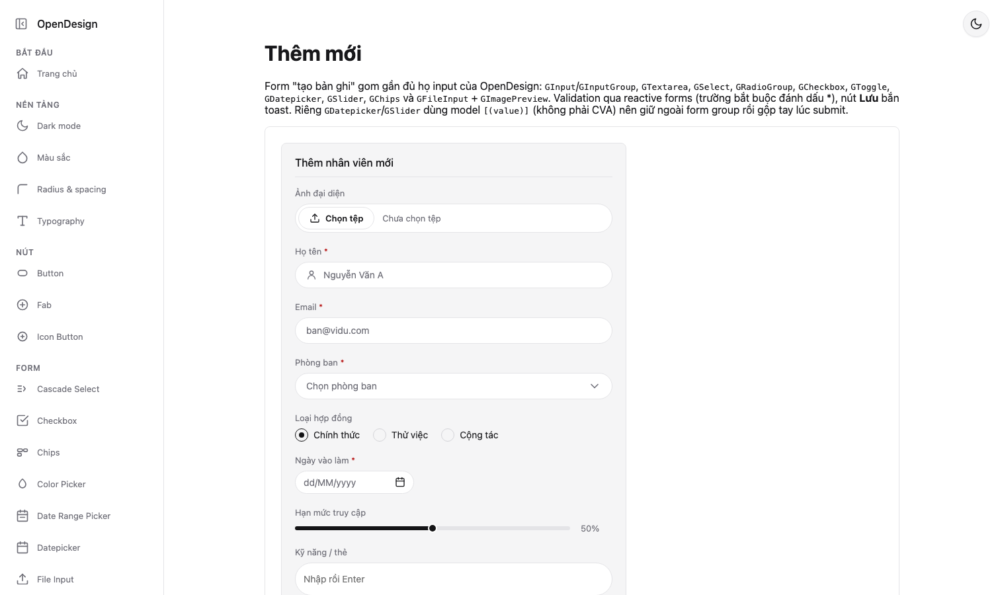

# OpenDesign

[](https://github.com/gingatimo/opendesign/actions/workflows/ci.yml)

Design system Angular với thẩm mỹ pill nhất quán, sáng/tối sẵn có, viết bằng signals — 61
component, standalone và `OnPush`. Package npm: [`ngx-opendesign`](projects/ngx-opendesign).

**Docs site (demo sống, code mẫu, bảng API):** https://gingatimo.github.io/opendesign/

Một vài màn dựng hoàn toàn bằng OpenDesign (ảnh chụp từ chính docs site):

**Dashboard** — `GTopbar` + `GSidebar` + thẻ số liệu ghép thành một layout hoàn chỉnh.



**Trang danh sách** — tìm kiếm, lọc theo trạng thái (nút) và vai trò (chip), bảng đóng băng cột + phân trang.



**Form thêm mới** — gần đủ họ input với validation reactive (trường bắt buộc tô viền đỏ).



Repo này là source của cả thư viện lẫn docs site. Nếu bạn chỉ muốn _dùng_ OpenDesign trong dự án
Angular của mình, xem [README của package](projects/ngx-opendesign/README.md) — hướng dẫn cài đặt
dành cho người tiêu thụ npm. README này (ở gốc repo) dành cho người muốn phát triển/đóng góp cho
chính dự án.

## Cấu trúc workspace

Angular CLI workspace gồm 2 project:

- `projects/ngx-opendesign` — thư viện component, build ra package `ngx-opendesign` publish lên
  npm.
- `projects/docs` — ứng dụng Angular hiển thị docs site (demo sống + code mẫu + bảng API cho từng
  component, deploy lên GitHub Pages).

## Phát triển

Yêu cầu Node.js tương thích Angular 22 trở lên.

```bash
git clone https://github.com/gingatimo/opendesign.git
cd opendesign
npm ci
npm start   # ng serve docs — mở http://localhost:4200
```

`npm start` chạy docs site với thư viện import trực tiếp từ source (không cần build lib trước) nhờ
path mapping của Angular CLI trong workspace.

### Test, lint, build

```bash
npm test           # test lib (ngx-opendesign) rồi test docs, Vitest, --watch=false
npm run lint        # eslint cho cả 2 project
npm run format       # prettier --write
npm run format:check # prettier --check (dùng trong CI)
npm run build:lib   # build package ngx-opendesign + biên dịch styles/opendesign.css
npm run build:docs  # build docs site production (dist/docs/browser)
```

CI (`.github/workflows/ci.yml`) chạy đủ 5 lệnh trên (trừ `format`) trên mỗi push và pull request.

## Quy trình phát hành

Repo có 2 workflow tự động, cả hai đều **chỉ chạy khi có người push** — không có bước nào tự kích
hoạt khi merge code thường:

- **`release.yml`** — trigger khi push tag khớp `v*`. Build lib rồi `npm publish` package
  `ngx-opendesign` lên npm (kèm [provenance](https://docs.npmjs.com/generating-provenance-statements/)).
- **`deploy-docs.yml`** — trigger khi push nhánh `main`. Build docs site với đúng base href, deploy
  lên GitHub Pages.

Các bước để phát hành một phiên bản mới của `ngx-opendesign`:

1. Bump version trong `projects/ngx-opendesign/package.json`.
2. Cập nhật `version` hardcode trong `projects/docs/src/app/pages/home.page.ts` (badge
   `v{{ version }}` ở đầu trang chủ) cho khớp — trang docs không tự đọc version từ `package.json`.
3. Cập nhật [`CHANGELOG.md`](CHANGELOG.md): đổi mục `chưa phát hành` hiện tại thành ngày phát hành
   thật, thêm mục mới ở trên cho các thay đổi tiếp theo.
4. Commit, tag `vX.Y.Z` (khớp version vừa bump), rồi `git push --tags`.
5. CI tự publish lên npm khi thấy tag mới.

### Trước khi tag lần đầu — việc cần làm thủ công (không nằm trong code)

- **Secret `NPM_TOKEN`**: vào Settings → Secrets and variables → Actions của repo, thêm secret tên
  `NPM_TOKEN` (access token có quyền publish của tài khoản npm). `release.yml` đọc secret này qua
  `NODE_AUTH_TOKEN` để xác thực với registry — thiếu secret thì bước publish sẽ fail.
- **Bật GitHub Pages**: vào Settings → Pages, đặt **Source: GitHub Actions**. Thiếu bước này thì
  `deploy-docs.yml` sẽ fail ở bước `configure-pages` vì chưa có cấu hình Pages nào để đọc.

## License

Apache-2.0
